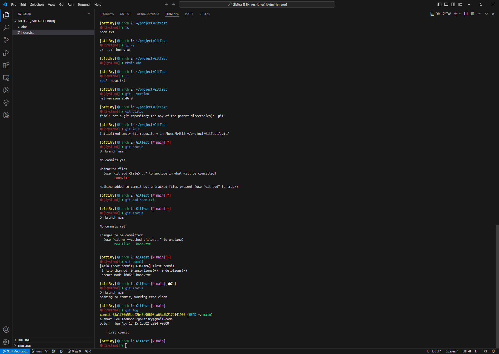

# 2024/08/13 1주차 파트 3

## Git 기본 이론

Git은 분산식 버전 관리 시스템

Git은 로컬(내 컴퓨터)에 설치되는 시스템

GitHub는 원격으로 중앙에서 우리 프로젝트를 백업해두고, 버전 관리 해주고, 협업도 하게 해주는 시스템

**Git은 내 컴퓨터 안에서 버전을 관리 해주는 시스템이자, GitHub와 소통하는 시스템**

**GitHub는 원격 컴퓨터에서 백업을 담당하는 시스템이자, 내 컴퓨터와 별도로 버전 관리도 해주는 시스템**

내 컴퓨터에 Git이 설치되어 있으면, 버전 관리를 로컬로 할 수 있을 뿐만 아니라 깃허브와 소통(백업, 복구, ...) 할 수 있다.

다른 컴퓨터에도 Git이 설치되어 있으면, GitHub를 통해서 소통(다운로드, 복제, 백업, ...) 할 수 있다.

**"협업"**

## Git 설치하기

<https://git-scm.com/book/ko/v2/시작하기-Git-설치>

성공적으로 설치가 되었다면 `git --version` 으로 확인할 수 있음

```console
$ git --version
git version 2.46.0
```

## CLI vs GUI

- CLI: 커맨드 라인 인터페이스
  - 셸에서 글자를 입력해서 컴퓨터에게 명령을 내리는 것

- GUI: 그래픽 유저 인터페이스
  - 그래픽으로 컴퓨터에게 명령을 내릴 수 있도록, 사용자에게 화면을 제공

## Git에서 자주 쓰이는 명령어

- ls
- cd
- init
- status
- add
- commit
- log

### git nit

Git은 시작부터 다 트래킹 하고 있지는 않음

### git add 파일명

Git에게 파일 트래킹 요청

### git commit

git add로 트래킹 한 파일을 버전으로 만듬

## Git 명령어 실습



## Git History Extension


