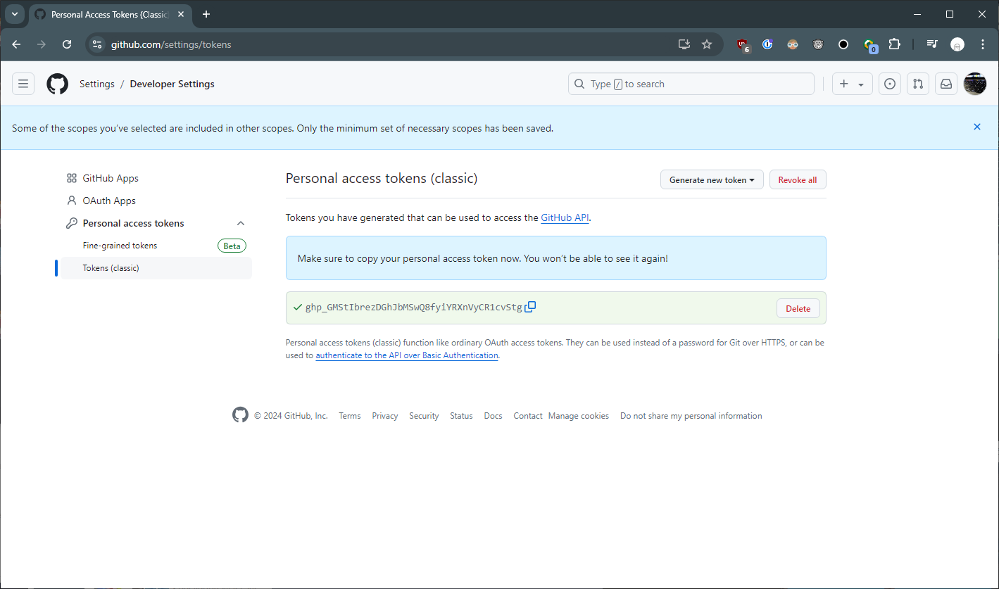

# 2024/08/14 1주차 파트 4

## GitHub Repository 연결

git remote add `원격 저장소 (GitHub Repository) 별칭` `원격 저장소 URL`

## GitHub Repository에 로컬 소스 올려보기

git push `원격 저장소 별칭` `원격 저장소 레포지토리 명`

## GitHub Repository를 로컬로 받아오기

git clone `원격 저장소 URL`

## GitHub Repository 생성 실습

## GitHub Repository 업로드 실습

## GitHub Token 생성

## GitHub Repository Clone 실습

