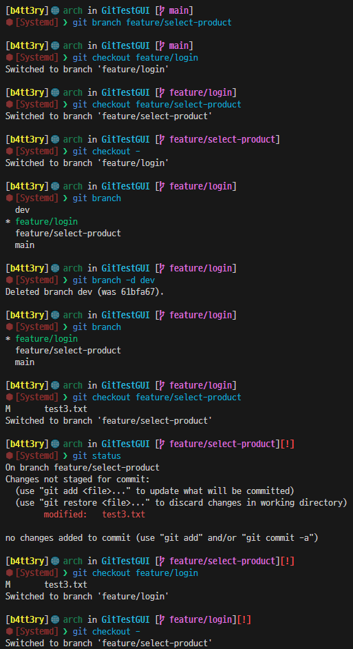
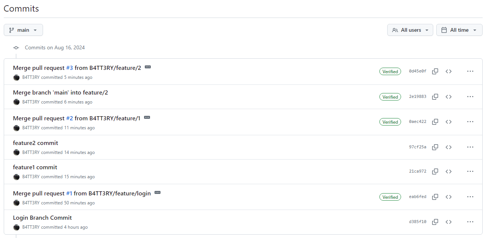
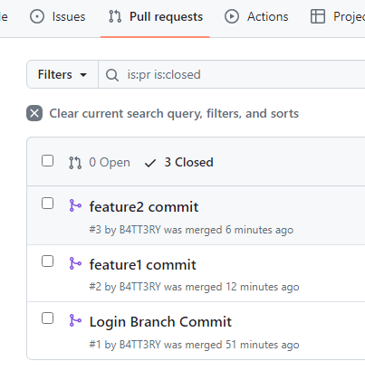

# 2024/08/16 1주차 파트 6

## Git Branch 이름 규칙

- 기능 개발: `feature/login`, `feature/select-product`
- 출시 준비: `release-1.3`, `release-1.4`
- 긴급 수정: `hotfix-1.2.1`

## GitHub에 Branch 생성하고 Git Branch 복제하기

Git에 만들어둔 Branch를 원격 Branch로 복제

git push `GitHub 저장소 별칭` `Git Branch 이름`

## Git Branch 전략

Git Flow라고도 불리며 전략은 다양하게 짤 수 있음

크게 2가지로

- fast-forward
- 3 way

### fast-forward 전략

A Branch에서 B Branch를 생성 한 시점부터 A Branch에는 아무런 추가 구현을 하지 않고 B Branch만 추가 구현 한뒤 B Branch와 A Branch를 합침

### 3 way 전략

A Branch에서 B Branch를 생성 한 시점부터 A Branch에서도 추가 구현을 하고 B Branch도 추가 구현을 해서 합친 다음 서로 비교하여 바뀐것을 정리하여 합치는 전략

## 병합

- 브랜치를 생성한다는 건, "협업"을 위한 것
- 그래서 우리는 주로 브랜치 병합(추가 가지 -> base 가지)을 

- main 브랜치 보호
- 추가 브랜치 -> main 브랜치 병합 = Pull Request
- 충돌 일어나는지 자동으로 확인 해줌
- merge
- branch 삭제

## Merge 된 GitHub - Git 동기화

- `git fetch -p`: GitHub Branch 목록 동기화
- -> (Git 브랜치 삭제) `git checkout main`
- -> `git pull origin main`
- -> `git branch -d feature/login`

## 로컬 Branch Commit 실습

## Pull Request 실습

