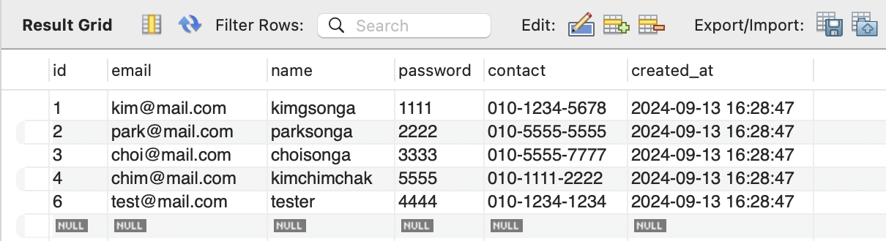
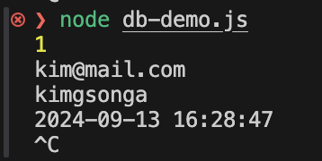

# timezone 설정 결과

## 타임존 설정 쿼리

```sql
SET GLOBAL time_zone = 'Asia/Seoul';
SET time_zone = 'Asia/Seoul';
```

현재 접속된 세션에서는 타임존이 바뀌지 않기 때문에 세션용으로도 설정해줘야 함





실습을 진행했던 2024년 9월 13일 오후 4시 28분으로 정상 출력됨
