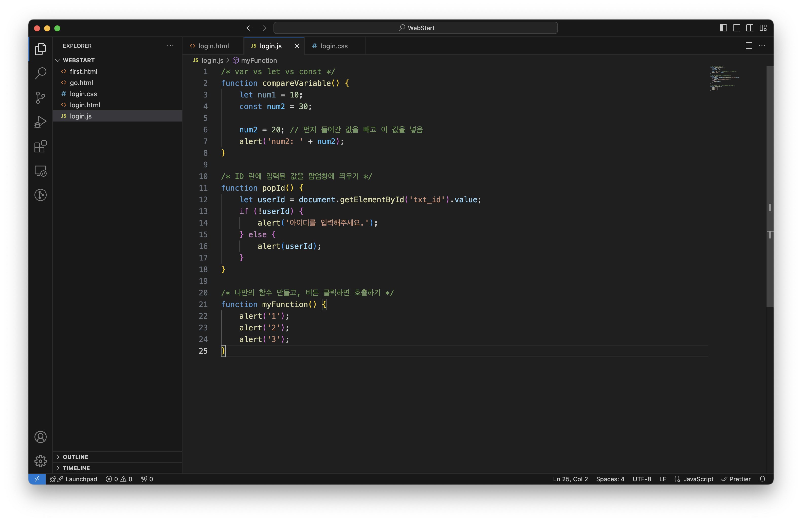
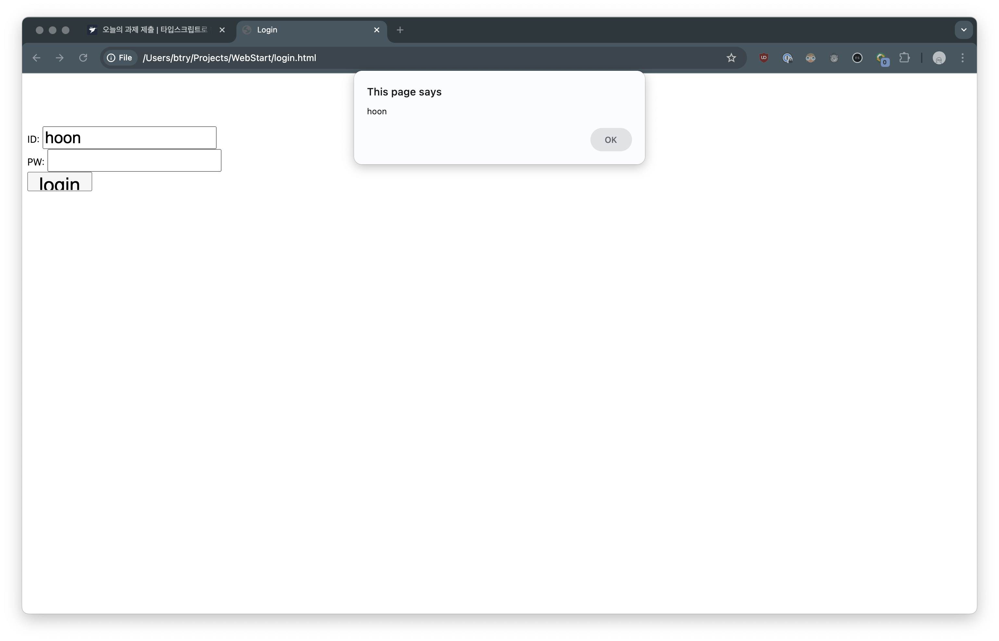

# 2024/08/21 2주차 파트 3

## CSS란?

Cascading Style Sheets의 약자로, HTML을 꾸며주는 언어임

문서를 통째로 한번에 꾸며주는 것이 아니라, HTML 태그를 하나하나 꾸며줌

### HTML에 CSS를 적용하는 방법

- 인라인 (Inline): HTML 태그 안에 같이 작성
  - `<h1 style="color: red;">Hello</h1>`
- 내부 스타일 시트 (Internal Style Sheet): HTML 문서 안에 같이 작성
  - `<style></style>` 태그 사용
- 외부 스타일 시트 (External Style Sheet): HTML 문서 밖에 작성 후 연결
  - .css 파일 생성 후 `<head>` 태그 하위에 `<link rel="stylesheet" href="파일명">` 로 연결

## CSS 기초 문법

```css
태그 {
    color: red;
    text-align: center;
}

.클래스 {
    font-size: 25px;
}

#아이디 {
    font-size: 30px;
    width: 100px;
    height: 30px;
}
```

## JavaScript란?

특정 HTML 요소를 선택하여 제어할 수 있는 스크립트 언어

최근 백엔드 언어로도 각광 받고 있음

### 스크립트 언어란?

독립적인 프로그램을 개발할 수 있는 프로그래밍 언어가 아닌

> "(프로그램 내부의 구성 요소 중 하나로) 프로그램을 제어하는 스크립트 역할을 하는 언어"

최근 빠르게 발전하는 런타임 환경 덕분에 스크립트 언어 만으로도 충분히 프로그래밍 가능

### 함수란?

특정 기능을 수행하는 코드 덩어리

#### 정의 방법

```javascript
function 함수이름() {
    /* 이 공간에
       함수가 할 일을
       코드로 작성해줍니다. */
}
```

## 실습 사진



