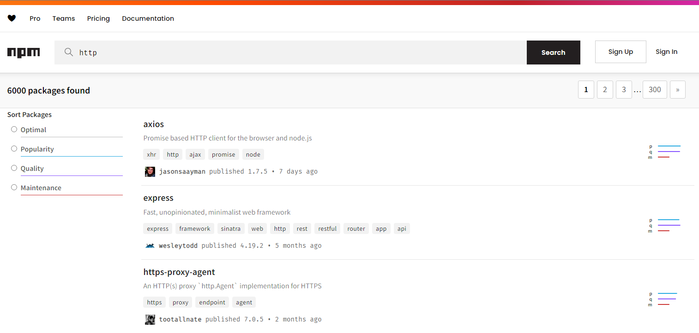

# Node.js 기본 생태계 정리

## 패키지 매니저

**N**ode.js **P**ackage **M**anager의 약자로 `npm` 이라고 부름

## npm registry

[npmjs.com](https://www.npmjs.com/)이 세계 최대 소프트웨어 레지스트리임

[Github](https://docs.github.com/ko/packages/working-with-a-github-packages-registry/working-with-the-npm-registry)와 [GitLab](https://docs.gitlab.com/ee/user/packages/npm_registry/)에서도 npm package registry를 구성할 수 있게 지원함

npmjs에는 매우 많은 라이브러리가 존재하기 때문에 내 프로젝트에 쉽게 적용하고 사용할 수 있음

예를 들어 `http`를 검색해보면 검색되는 라이브러리가 6,000개나 존재함



## 간단 npm 사용법

```console
npm init
```

`package.json (의존성 패키지 관리를 위함)`을 생성

```console
npm install 패키지 명
```

`npm i` 로 줄여 쓸 수 있음

이 프로젝트에 라이브러리(패키지)를 설치

```console
npm uninstall 패키지 명
```

설치했던 패키지와 관련된 파일이 모두 삭제됨
