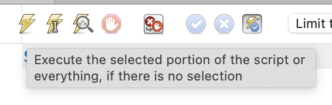
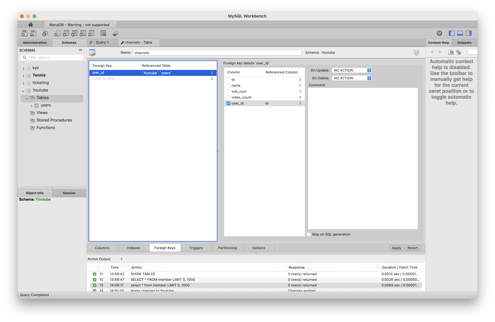

# 2024/09/13 5주차 파트 5

## MySQL Workbench 쿼리 실행하는 법



상단의 번개모양 아이콘을 누르면 쿼리를 실행할 수 있음

## Zero Fill

INT 타입에 자릿수가 지정되어 있으면 빈 자리를 0으로 채움

예)

```text
INT(10) -> 1 입력 -> 0000000001
```

## MySQL Workbench Foreign Key 설정



## Node.js DB 연동

mariadb, mysql2 등의 모듈이 존재하나 강의에서는 mysql2 사용

```js
const mysql = require('mysql2');

const connection = mysql.createConnection({
    host: 'localhost',
    user: '****',
    password: '****',
    database: 'Youtube',
});

connection.query(
    'SELECT * FROM `users`',
    function (err, results, fields) {
        console.log(results); // results contains rows returned by server
        console.log(fields); // fields contains extra meta data about results, if available
    }
);
```

## MariaDB Time Zone

```sql
SET GLOBAL time_zone = 'Asia/Seoul';
SET time_zone = 'Asia/Seoul';
```

```sql
SELECT @@global.time_zone, @@session.time_zone;
```

혹은 테이블 조회로 변경 확인 가능

글로벌 타임존을 변경해도 현재 세션에 대해서는 변경되지 않기 때문에 세션 타임존도 같이 설정해줘야 함
