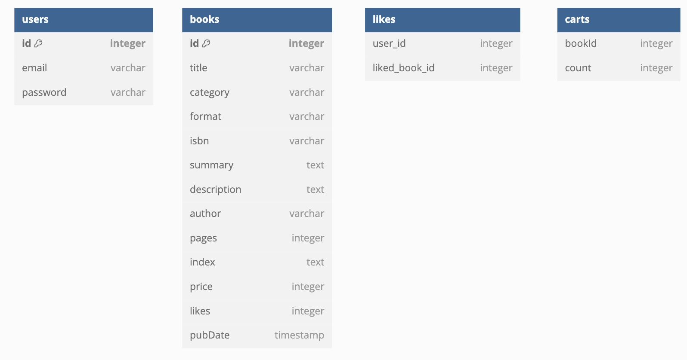

# 2024/09/30 7주차 파트 1

[dbdiagram.io](https://dbdiagram.io) 사용하여 ERD 그리기

## ERD

```text
Table users {
  id integer [primary key]
  email varchar
  password varchar
}

Table books {
  id integer [primary key]
  title varchar
  category varchar
  format varchar
  isbn varchar
  summary text
  description text
  author varchar
  pages integer
  index text
  price integer
  likes integer
  pubDate timestamp
}

Table likes {
  user_id integer
  liked_book_id integer
}

Table carts {
  bookId integer
  count integer
}
```



## 좋아요 API 수정

1. 좋아요 추가

    |Key|Value|
    |---|---|
    |Method|POST|
    |URI|/likes/:bookId|
    |HTTP Status Code|200 OK|
    |Request Body||
    |Response Body||

1. 좋아요 취소

    |Key|Value|
    |---|---|
    |Method|DELETE|
    |URI|/likes/:bookId|
    |HTTP Status Code|200 OK|
    |Request Body||
    |Response Body||

## 주문 API -> 장바구니 API 수정

1. 장바구니에서 선택한 상품 목록 조회

    |Key|Value|
    |---|---|
    |Method|GET|
    |URI|/...|
    |HTTP Status Code|200 OK|
    |Request Body||
    |Response Body|[{ cartItemId: 장바구니 도서 ID, bookId: 도서 ID, title: "도서 제목", summary: "도서 요약", count: 수량 price: 가격 }, ...]|

## 결제 API 추가

1. 결제하기 = 주문하기 = 주문 등록 = 데이터베이스 주문 insert = 장바구니에서 주문된 상품은 delete

    |Key|Value|
    |---|---|
    |Method|POST|
    |URI|/orders|
    |HTTP Status Code|200 OK|
    |Request Body|{ items: [{ cartItemId: 장바구니 도서 ID, bookId: 도서 ID, count: 수량 }, ...], delivery: { address: "주소", receiver: "이름", contact: "010-0000-0000" }, totalPrice: 총 금액 }|
    |Response Body||

1. 주문 목록(내역) 조회

    |Key|Value|
    |---|---|
    |Method|GET|
    |URI|/orders|
    |HTTP Status Code|200 OK|
    |Request Body||
    |Response Body|[{ created_at: "주문일자", delivery: { address: "주소", receiver: "이름", contact: "전화번호" }, bookTitle: "대표 책 제목", totalPrice: 결제 금액}, ...]|

1. 주문 상세 상품 조회

    |Key|Value|
    |---|---|
    |Method|GET|
    |URI|/orders/:orderId|
    |HTTP Status Code|200 OK|
    |Request Body||
    |Response Body|[{ bookId: 도서 ID, bookTitle,: "도서 제목", author: "작가명", price: 가격, count: 수량 }, ...]|
