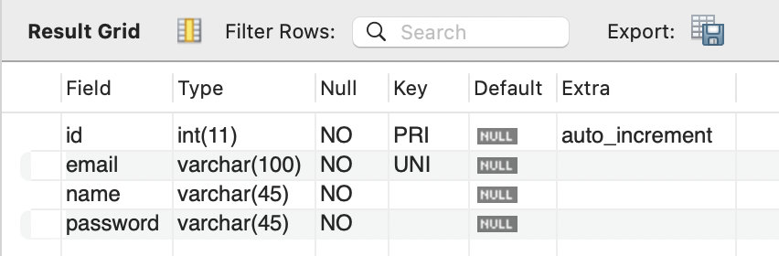

# 2024/10/01 7주차 파트 2

## express-generator 프로젝트 구조

- bin/www: 포트 번호 등과 같은 웹 서버를 구축하는 데 필요한 설정 데이터가 정의되어 있는 파일
  - .env 파일과 같이 설정값을 가지고 에러 처리, 기타 추가 설정을 해주는 파일
- node_modules: Node.js, Express에 필요한 모듈들이 설치되는 폴더
- public: images, javascripts, stylesheets -> 정적 파일 (ex. 로고, 회사 소개 페이지 등)
  - cf. 동적: 사람마다 다른 데이터
- routes: 각 경로를 담당하는 모듈들이 들어있는 폴더
  - 라우팅 로직을 구현하는 모듈들
  - 클라이언트에서 어떤 요청을 주냐에 따라서 어떤 로직을 수행할 지 파일별로 분할해서 관리하는 정도
  - cf. 자바의 Controller 역할
- views: 클라이언트에게 html 코드로 **화면을 보내는 파일**
- app.js: Express 서버의 시작점, URL에 따라 라우팅 해줌
- package.json: 이 프로젝트에 설치된 모듈 이름, 버전 등의 정보들이 작성되어 있는 파일

## API URL 변경

- 회원가입, 로그인, 비밀번호 초기화 요청, 비밀번호 초기화 `/users/` 하위로 이동

## users 테이블 생성

```sql
DESC users;
```


