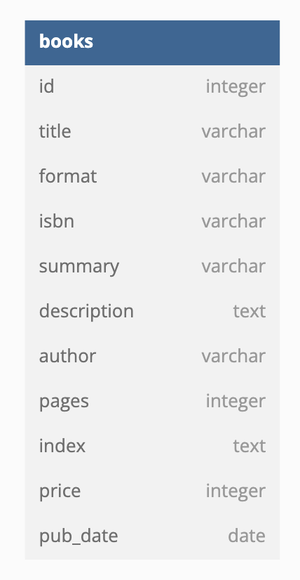

# 2024/10/04 7주차 파트 5

## `books` ERD

```text
Table books {
  id integer
  title varchar
  format varchar
  isbn varchar
  summary varchar
  description text
  author varchar
  pages integer
  index text
  price integer
  pub_date date
}
```



## 더미 이미지

[picsum](https://picsum.photos) 이라는 서비스 사용

img 필드에는 picsum의 이미지 id값만 저장

## 카테고리 API 추가

1. 카테고리 전체 조회

    |Key|Value|
    |---|---|
    |Method|GET|
    |URI|/category|
    |HTTP Status Code|200 OK|
    |Request Body||
    |Response Body|[{ id: 0, name: "동화" }, { id : 1, name: "소설" }, ...]|
