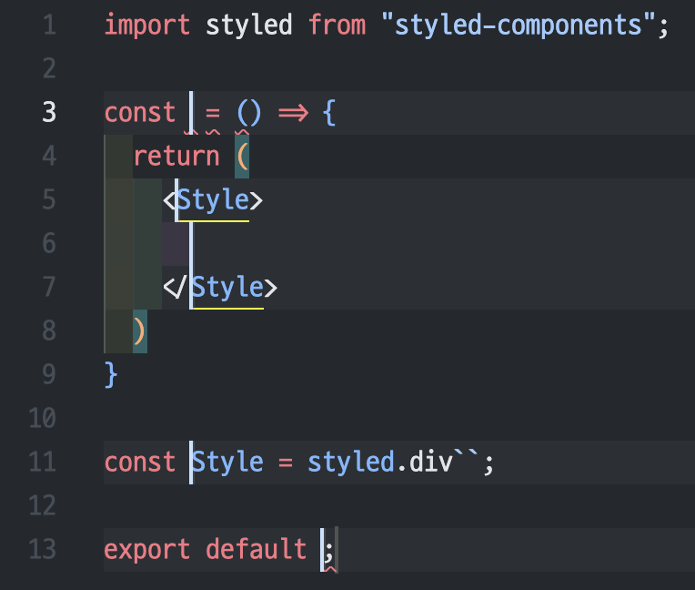

# 스니펫 소개

```json
{
  "_comp": {
    "prefix": "_comp",
    "body": [
      "import styled from \"styled-components\";",
      "",
      "const $1 = () => {",
      "\treturn (",
      "\t\t<$1Style>",
      "\t\t\t$1",
      "\t\t</$1Style>",
      "\t)",
      "}",
      "",
      "const $1Style = styled.div``;",
      "",
      "export default $1;"
    ]
  },
  ...
}
```

이렇게 스니펫을 작성하면


가 생김



`$1` 등을 입력한 곳에 멀티커서로 입력할 수 있게 됨

```json
{
  ...
  "_effect": {
    "prefix": "_effect",
    "body": [
      "useEffect(() => {$1}, [$2]);"
    ]
  },
  ...
}
```


`$1`을 입력하고 탭을 입력하면 `$2`로 넘어감
