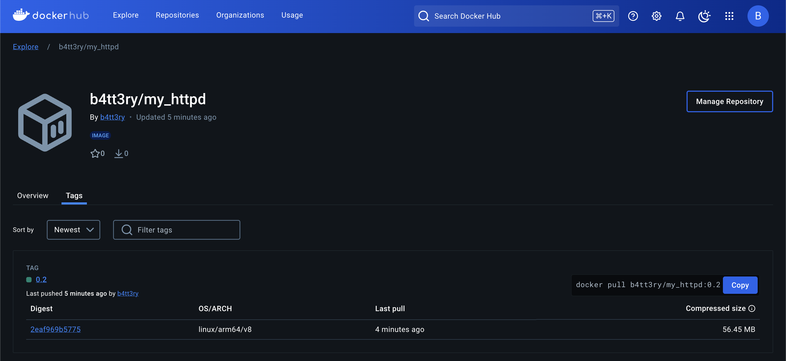

# 도커 이미지 생성 실습

## Dockerfile

```dockerfile
FROM httpd:latest

RUN echo "<html><body><h1>Docker build test</h1></body></html>" > /usr/local/apache2/htdocs/index.html

ENTRYPOINT /usr/local/bin/httpd-foreground
```

## 이미지 빌드

```console
$ docker build -t my_httpd:0.2 .
[+] Building 5.6s (6/6) FINISHED                                                                          docker:orbstack
 => [internal] load build definition from Dockerfile                                                                 0.0s
 => => transferring dockerfile: 242B                                                                                 0.0s
 => [internal] load metadata for docker.io/library/httpd:latest                                                      3.0s
 => [internal] load .dockerignore                                                                                    0.0s
 => => transferring context: 2B                                                                                      0.0s
 => [1/2] FROM docker.io/library/httpd:latest@sha256:6bdbdf5ac16ac3d6ef543a693fd5dfafae2428b4b0cdc52a480166603a0691  2.2s
 => => resolve docker.io/library/httpd:latest@sha256:6bdbdf5ac16ac3d6ef543a693fd5dfafae2428b4b0cdc52a480166603a0691  0.0s
 => => sha256:6d29a096dd42e5e003949f934fa6b1a3ec8e076dd8cfc2a85a4e750a3639bf7a 29.16MB / 29.16MB                     1.0s
 => => sha256:4c3f91c84bc0dea30d0331554cea0cc77845d70262033746596ae85a1f0c0efe 145B / 145B                           0.6s
 => => sha256:6bdbdf5ac16ac3d6ef543a693fd5dfafae2428b4b0cdc52a480166603a069136 10.16kB / 10.16kB                     0.0s
 => => sha256:6a93c561478be9882b1a75f9004a0f830bbafeb242a20d39240e2b4dc8f398dc 8.01kB / 8.01kB                       0.0s
 => => sha256:4f4fb700ef54461cfa02571ae0db9a0dc1e0cdb5577484a6d75e68dc38e8acc1 32B / 32B                             0.5s
 => => sha256:fc618b49dce39b214433a79f03739ec3b0cc7a3f12357b08ecc2af428a45227c 2.10kB / 2.10kB                       0.0s
 => => sha256:deb8a6f98fe992d4323c2520238775ab87d5fe8f53cc1a18597c7a76aecda78c 4.03MB / 4.03MB                       1.0s
 => => sha256:5e6d32c400c1a568c316b8ceb40f800c86f9860f9d8e5b2ed40e868bf32f3008 26.00MB / 26.00MB                     1.5s
 => => extracting sha256:6d29a096dd42e5e003949f934fa6b1a3ec8e076dd8cfc2a85a4e750a3639bf7a                            0.6s
 => => sha256:ee212e1cfb15e58b745ccd40ada254689f106d39186ef6803c68a47d0f0cabbb 292B / 292B                           1.7s
 => => extracting sha256:4c3f91c84bc0dea30d0331554cea0cc77845d70262033746596ae85a1f0c0efe                            0.0s
 => => extracting sha256:4f4fb700ef54461cfa02571ae0db9a0dc1e0cdb5577484a6d75e68dc38e8acc1                            0.0s
 => => extracting sha256:deb8a6f98fe992d4323c2520238775ab87d5fe8f53cc1a18597c7a76aecda78c                            0.1s
 => => extracting sha256:5e6d32c400c1a568c316b8ceb40f800c86f9860f9d8e5b2ed40e868bf32f3008                            0.3s
 => => extracting sha256:ee212e1cfb15e58b745ccd40ada254689f106d39186ef6803c68a47d0f0cabbb                            0.0s
 => [2/2] RUN echo "<html><body><h1>Docker build test</h1></body></html>" > /usr/local/apache2/htdocs/index.html     0.2s
 => exporting to image                                                                                               0.0s
 => => exporting layers                                                                                              0.0s
 => => writing image sha256:1595584bec227b1549454b3e1937f17a3ad7c9eb3a88a0f846b3efe6f7c7d365                         0.0s
 => => naming to docker.io/library/my_httpd:0.2                                                                      0.0s

 1 warning found (use docker --debug to expand):
 - JSONArgsRecommended: JSON arguments recommended for ENTRYPOINT to prevent unintended behavior related to OS signals (line 5)
```

```console
$ docker images
REPOSITORY   TAG       IMAGE ID       CREATED         SIZE
my_httpd     0.2       1595584bec22   6 minutes ago   178MB
...
```

## 실행

```console
$ docker run --rm my_httpd:0.2
AH00558: httpd: Could not reliably determine the server's fully qualified domain name, using 192.168.215.2. Set the 'ServerName' directive globally to suppress this message
AH00558: httpd: Could not reliably determine the server's fully qualified domain name, using 192.168.215.2. Set the 'ServerName' directive globally to suppress this message
[Mon Dec 02 09:24:38.908308 2024] [mpm_event:notice] [pid 7:tid 7] AH00489: Apache/2.4.62 (Unix) configured -- resuming normal operations
[Mon Dec 02 09:24:38.908436 2024] [core:notice] [pid 7:tid 7] AH00094: Command line: 'httpd -D FOREGROUND'
```

```console
$ curl 192.168.215.2
<html><body><h1>Docker build test</h1></body></html>
```

## Docker Hub 배포

### 로그인

```console
$ docker login

USING WEB-BASED LOGIN
To sign in with credentials on the command line, use 'docker login -u <username>'

Your one-time device confirmation code is: ****-****
Press ENTER to open your browser or submit your device code here: https://login.docker.com/activate

Waiting for authentication in the browser…

Login Succeeded
```

### 태그 지정

```console
docker tag my_httpd:0.2 <Docker Hub의 username>/my_httpd:0.2
```

### push

```console
$ docker push b4tt3ry/my_httpd:0.2
The push refers to repository [docker.io/b4tt3ry/my_httpd]
3da037d2417f: Pushed 
ed5c6515ffd0: Mounted from library/httpd 
b2c8a9d05223: Mounted from library/httpd 
50b685814c08: Mounted from library/httpd 
5f70bf18a086: Mounted from library/httpd 
6c0b0dfd5748: Mounted from library/httpd 
077584c0c75a: Mounted from library/httpd 
0.2: digest: sha256:2eaf969b5775b02d6b67f457211e45cadc331ab6261d987cee152968fc719974 size: 1779
```


